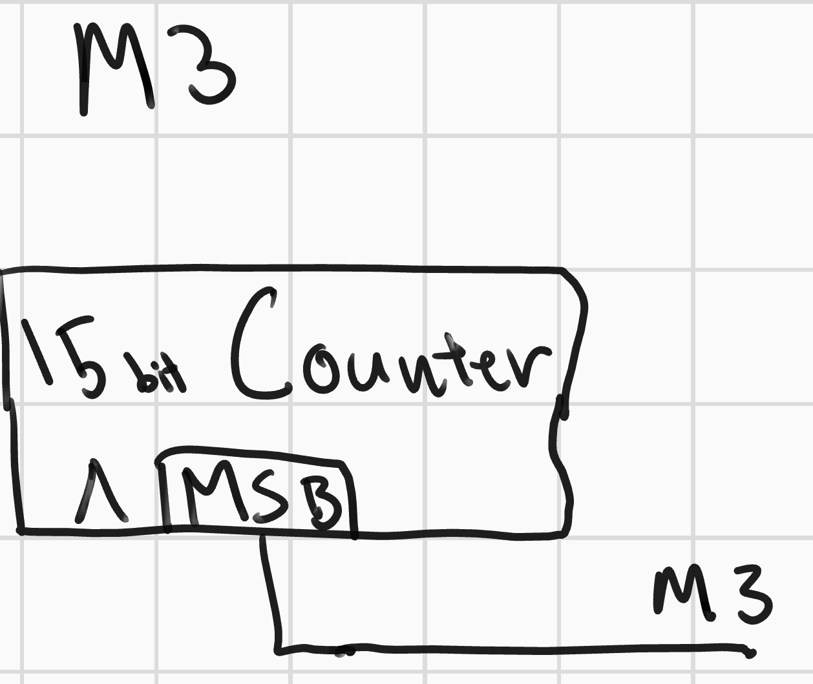

# Comparch Midterm

The goal of this midterm is to design a simple bikelight capable of handling human input via a button press and to change modes among 4 different options. Rather than being a Verilog-heavy assignment, the focus here is to dive into the technical challenge of using logic gates and fundamental skills to design a real-world product. 

## Specification Document

Starting off, we must be extremely clear about the specifications of the bikelight design.

- The bikelight has a single push button
- Pressing and releasing the push button changes the mode of the bikelight
- The button must be pushed *and* released for the light mode to change
- The light mode must progress from (1) off to (2) on to (3) blinking and then to (4) dimmed and then back to off

- The clock is 32,768 Hz frequency

## Block Diagram

A handful of custom useful blocks were made to make the design of the ALU simpler. We present them here but there is more detail about them in the Schematics section.

- 1 bit adder
- 2 bit adder
- 33 bit Shift register
- 15 bit counter
- 2 bit counter

Building on these custom blocks, we also have custom blocks for the
- synchronizer
- debounce handler
- mode select
- mode 3
- mode 4

### Synchronizer and debouncer handler

The synchronizer and debounce handler is very straightforward. The synchronizer is a chain of two flip flops synced to Clk which feed into the 33 bit serial-in, parallel out shift register. 

The output of the shift register is compared against a match signal which is designed to match the release of a button push. If the signal matches, then the output is enabled for a single clock tick and is fed into the mode select adder.

There are a total of 35 positive-edge triggered D-flip flops with area 13 each and 33 nand gates with area 2 each, and one final inverter on the output. 35 * 13 + 33 * 2 + 1 = 522

- Inputs: Clk, ButtonSignal
- Outputs: ButtonPress
- Area: 522

### Mode selecter

The mode selecter is a two part machine - a 2 bit counter and a 4x1 mux. The counter increases and wraps around continuously, adding whatever is on the input to the current count. The mux then selects from the corresponding signal modes for the correct output.

The total area of the device comes from the counter which has an area of 20 per bit with two bits, and the mux with 30  for a total of 50.

- Inputs: M1 (Fixed Signal Low), M2 (Fixed Signal High), M3, M4, ButtonPress, Clk
- Outputs: LED_enable 
- Area: 50

### M3 (Mode 3: Blinking)

Area: 15 bit * 20 per bit

- Inputs: Clk
- Outputs: LED_enable 
- Area: 300

### M4 (Mode 4: Dim)

- Inputs: Clk
- Outputs: LED_enable 
- Area: 43

## Schematics
Schematics for the system are shown above, but not all blocks are shown. Here are the schematics for each of the crucial individual blocks:

### 1 bit adder

The area of the onebit adder is 7 (sum of all the inputs and inverters)

- Inputs: A, B, Cin
- Outputs: Res, Cout
- Area: 7

### N-bit counter

An n-bit counter that doesn't have overflow (wraps around) is just n 1-bit adders and a n-bit parallel load register (13 per bit). Per bit, the total cost is 20.

- Inputs: Add, Clk,
- Outputs: Res
- Area: 20 per bit

### 2:1 Mux

This mux has 2 and gates, 1 inverter, and 1 or gate for a total cost of 10

- Inputs: A, B, Sel
- Out: Out
- Area: 10

### 4:1 Mux

This mux has two 2:1 muxes with 10 cost each, 2 and gates, an or gate, and an inverter for a total cost of 30.

- Inputs: A,B,C,D, Sel1, Sel2
- Output: Out
- Area: 30

## Cost Estimation Model

The final design cost:
- Debouncer: 522
- Mode Select: 50
- M3: 300
- M4: 43
- LED Driver: 161

Total: 1076

## Conclusion

We designed a very simple bikelight using just circuit components. A very interesting choices were made along the way to simplify the final design. The debouncer implemented here is a very costly solution for something that could be about a tenth the overall size. However, its simple design made implementing the debounce mechanic very quick and easy to understand. An alternative approach could involve another timer and adder combination. Another interesting choice was the use of the counters for the light patterns. This implementation is also fairly large and doesn't provide a whole lot of flexibility. The on/off periods can be tweaked, but they can't be changed while the circuit is running.

Overall, this midterm served as an interesting look into designing functional products with just a handful of basic logic gates and skills in computer architecture.